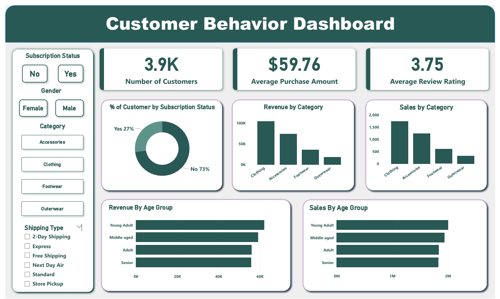

# 🛍 Customer Shopping Behavior Analysis  
### End-to-End Data Analytics Project (SQL + Python + Power BI)

An end-to-end retail analytics project that analyzes customer shopping behavior to uncover purchasing trends, revenue patterns, and business insights using SQL, Python, and Power BI.

---

## 📊 Project Overview

Retail businesses generate large volumes of transactional data but often struggle to extract actionable insights.

This project transforms raw shopping data into meaningful business intelligence by:

- Cleaning and analyzing data using Python
- Performing advanced business queries using SQL
- Building an interactive dashboard in Power BI
- Generating data-driven business recommendations

---

## 🎯 Business Problem

Retail companies face several challenges:

- Identifying high-value customers
- Understanding product category performance
- Tracking seasonal revenue trends
- Improving customer retention
- Optimizing payment channel strategy

Without proper analytics, decision-making becomes guesswork.

This project provides a structured analytical solution to solve these business challenges.

---

## 📁 Dataset

File Used:
- `customer_shopping_behavior_1.csv`

The dataset contains:

- Customer ID
- Gender
- Age
- Product Category
- Quantity
- Price
- Payment Method
- Shopping Mall
- Purchase Date

---

## 🛠 Tools & Technologies

- Python (Pandas, NumPy, Matplotlib, Seaborn)
- SQL (Aggregation, Grouping, Filtering, Business KPIs)
- Power BI (Interactive Dashboard, DAX Measures)
- Jupyter Notebook

---

## 🔎 Project Workflow

### 1️⃣ Data Cleaning (Python)
- Removed duplicates
- Handled missing values
- Converted date formats
- Created revenue column (Price × Quantity)
- Feature engineering for month & age group

---

### 2️⃣ SQL Business Analysis

Performed queries for:

- Top customers by spending
- Category-wise revenue
- Monthly revenue trend
- Average order value
- Gender-based purchase behavior
- Payment method analysis

---

### 3️⃣ Power BI Dashboard

Created interactive dashboard showing:

- Total Revenue KPI
- Total Customers
- Monthly Sales Trend
- Revenue by Category
- Revenue by Gender
- Payment Method Distribution
- Age Group Segmentation

---

## 📊 Key Insights

- A few product categories generate majority of revenue.
- Female customers show higher average transaction value.
- Digital payment usage is increasing.
- Revenue peaks during specific months (seasonal trend).
- 20% of customers contribute large portion of total revenue (Pareto effect).

---

## 📈 Business Recommendations

- Launch loyalty programs for high-value customers
- Focus marketing on top-performing categories
- Offer seasonal discounts during peak months
- Promote digital payment incentives
- Personalize marketing based on age segmentation

## 🧠 Skills Demonstrated

- Data Cleaning & Preprocessing Using Python
- SQL Aggregation & Business Queries
- Data Visualization
- KPI Modeling
- Business Insight Generation
- End-to-End Analytics Thinking

---

## 📊 Dashboard Preview

